# Introduction

This document demonstrates GitHub collaboration and version control using Git branches.

# Step 1: Creating a Quarto Document

A new project was created in Positron to organise the workflow. Inside this project, a Quarto document named `example.qmd` was created.
The file contains a simple R code chunk to demonstrate execution within Quarto.

## Example Code

The following code shows a preview of the `mtcars` dataset and calculates the average miles per gallon.

```{r}
#| echo: true
head(mtcars)
mean(mtcars$mpg)
```

The document was rendered into HTML using the following command in the terminal:

`quarto render example.qmd --to html`

This generated an HTML file, confirming that the Quarto document renders correctly and executes R code.

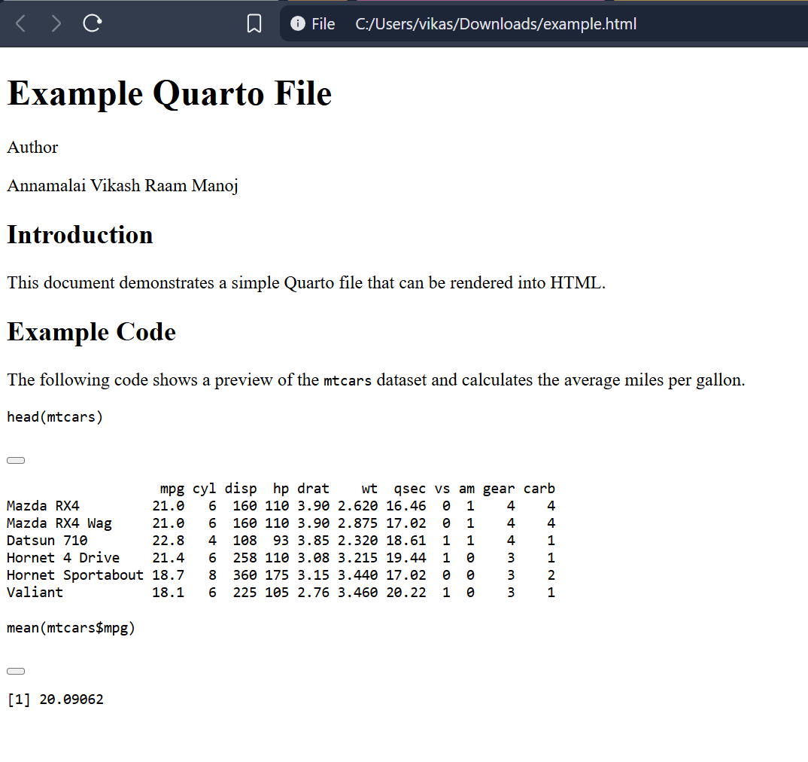

# Step 2: Initialising Git and Pushing to GitHub

* The project folder was initialised as a Git repository using the command: `git init`

    This creates a hidden .git directory that allows Git to track changes in the project.

* All files in the project were added to the staging area using:

    `git add .`

    This prepares the files to be committed.

* An initial commit was created using:

    `git commit -m "Initial commit: added example quarto file and rendered HTML output"`

    This saves the current state of the project in the Git history.

* A remote repository was then created on GitHub and linked to the local repository using:

    `git remote add origin <repository-url>`
    
    `git branch -M main`

    `git push -u origin main`

    These commands connect the local repository to GitHub and push the committed files to the remote repository, making them available online.

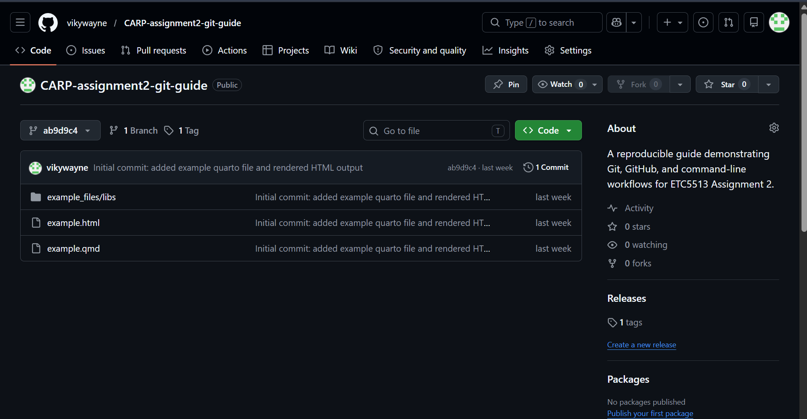

# Step 3: Creating and Working on a Branch

* A new branch named `testbranch` was created and checked out using:
    
    `git checkout -b testbranch`

    This creates a separate branch for development without affecting the `main` branch.

* The `example.qmd` file was modified in the branch and the changes were staged.

* The changes were committed using:

    `git commit -m "Updated introduction in testbranch"`

    This saves the modifications in the branch history.

* The branch was then pushed to GitHub using:

    `git push -u origin testbranch`

    This creates a remote version of the branch and links it to the local branch.

# Step 4: Amending a Previous Commit

* A `data` folder was created and the dataset from Assignment 1 was added to it.

* Instead of creating a new commit, the previous commit was amended using:

    `git commit --amend -m "Updated introduction and added data folder"`

* This updates the most recent commit by including the newly added files.
  
  The amended commit was pushed to GitHub using:
  
    `git push --force`
  
  Force push was required because amending a commit changes the commit history and creates a new commit hash.

# Step 5: Creating a Merge Conflict on Main

* The `main` branch was checked out again and the introduction section in `example.qmd` was modified differently from the version in `testbranch`.

* The updated file was committed using:

    `git commit -m "Modified introduction in main branch for merge conflict"`

* The changes were then pushed to GitHub.

    Modifying the same section differently in both branches intentionally created a merge conflict scenario.

# Step 6: Merging and Resolving a Conflict

* The changes from `testbranch` were merged into the `main` branch using:

    `git merge testbranch`

* Git detected a merge conflict because the same line had been modified differently in both branches.

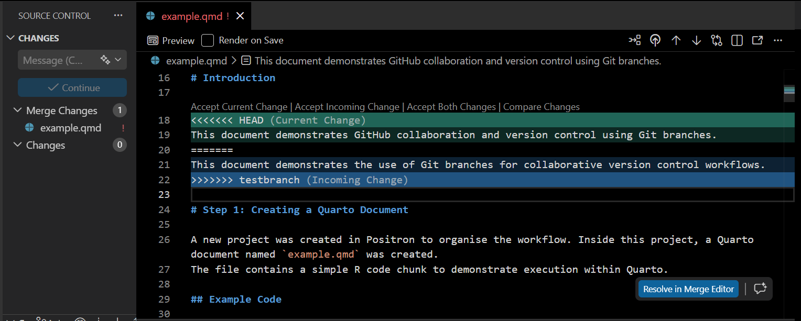

* The conflict markers were manually removed and the correct final version of the text was retained.

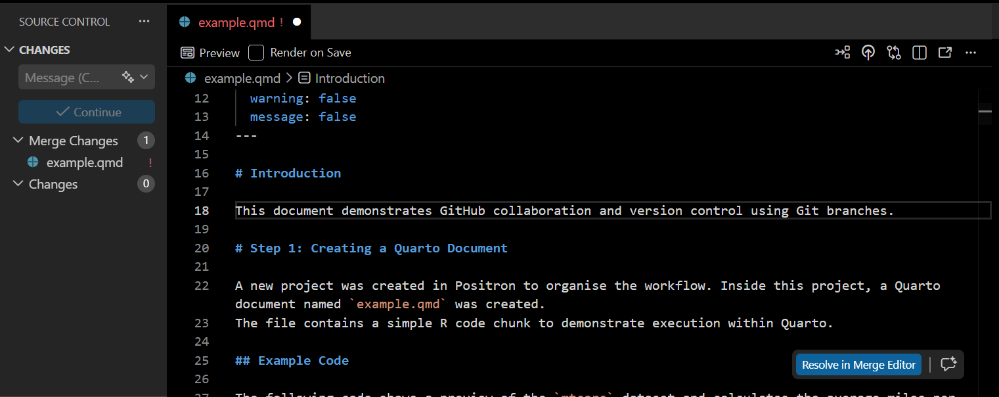

* After resolving the conflict, the merge was completed using:

    `git commit -m "Resolved merge conflict between main and testbranch"`

* The resolved merge was then pushed to GitHub using:

    `git push`

    This updated the remote repository with the merged changes.

# Step 7: Creating an Annotated Tag

* An annotated tag named `v1.0` was created using:

    `git tag -a v1.0 -m "Version 1.0 after merge conflict resolution"`

    This tag marks a stable project version after resolving the merge conflict.

* The tag was pushed to GitHub using:

    `git push origin v1.0`

    This made the version tag available in the remote repository.

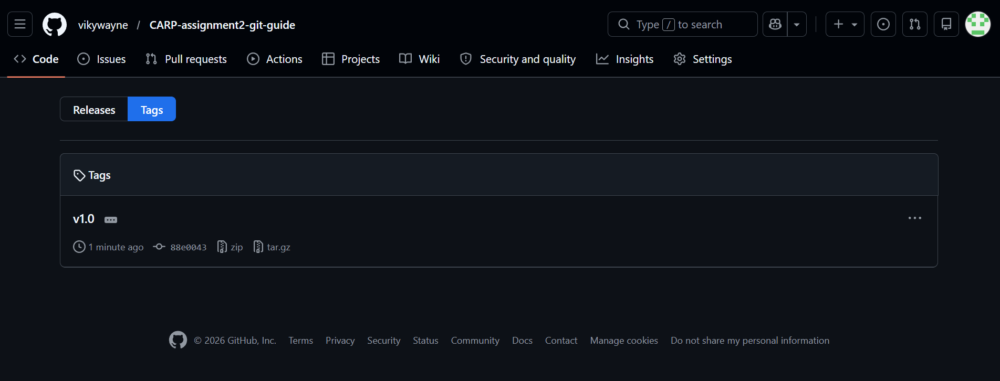

# Step 8: Deleting the Branch

* After the merge was completed, the `testbranch` branch was deleted locally using:

    `git branch -d testbranch`

* The remote version of the branch was deleted from GitHub using:

    `git push origin --delete testbranch`

    Removing unused branches helps keep the repository organised.

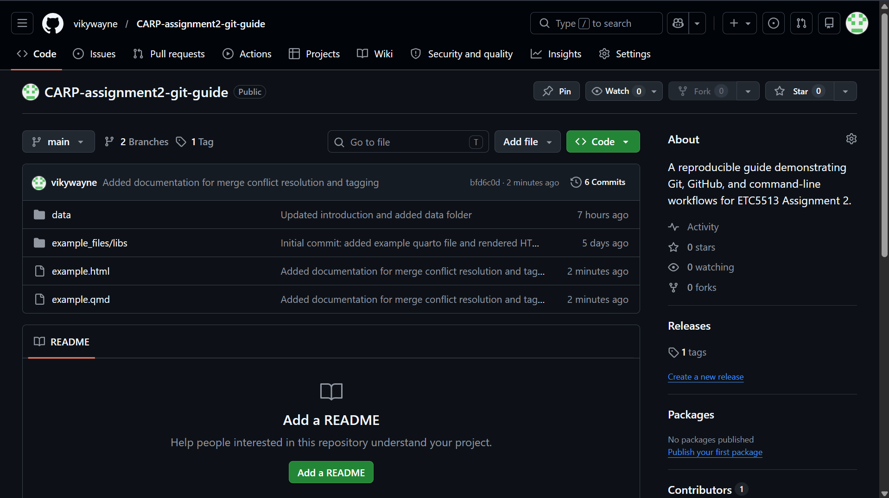

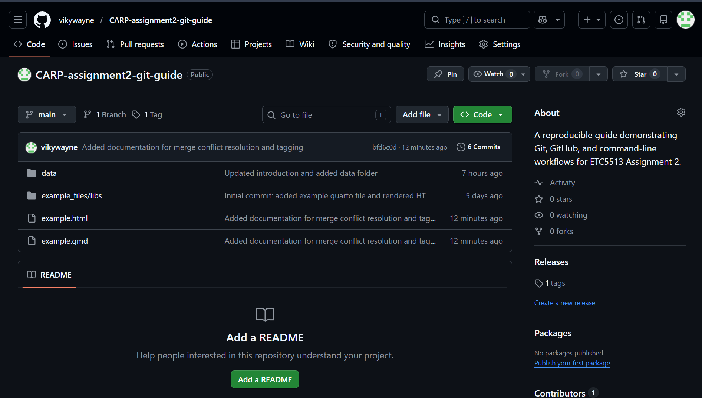

# Step 9: Viewing the Commit History

* The condensed commit history was displayed using:

    `git log --oneline`

    This command provides a simplified view of the commit history, showing commit hashes and commit messages.

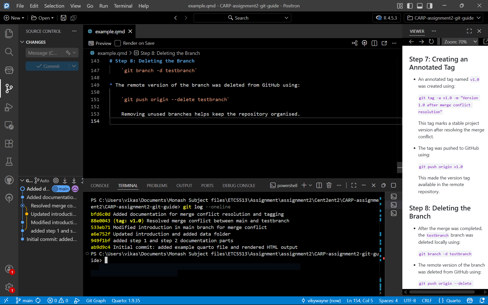

# Step 10: Undoing a Commit Without Losing Changes

* A new section containing a simple plot was added to the Quarto document.

```{r}
plot(mtcars$wt, mtcars$mpg,
     main = "Weight vs MPG",
     pch = 19,
     col = "blue")
```

* The changes were committed using:

    `git commit -m "Added plot section for reset demonstration"`

* The commit was then undone without removing the local file changes using:

    `git reset --soft HEAD~1`

    This removed the most recent commit from the Git history while keeping the changes available locally.

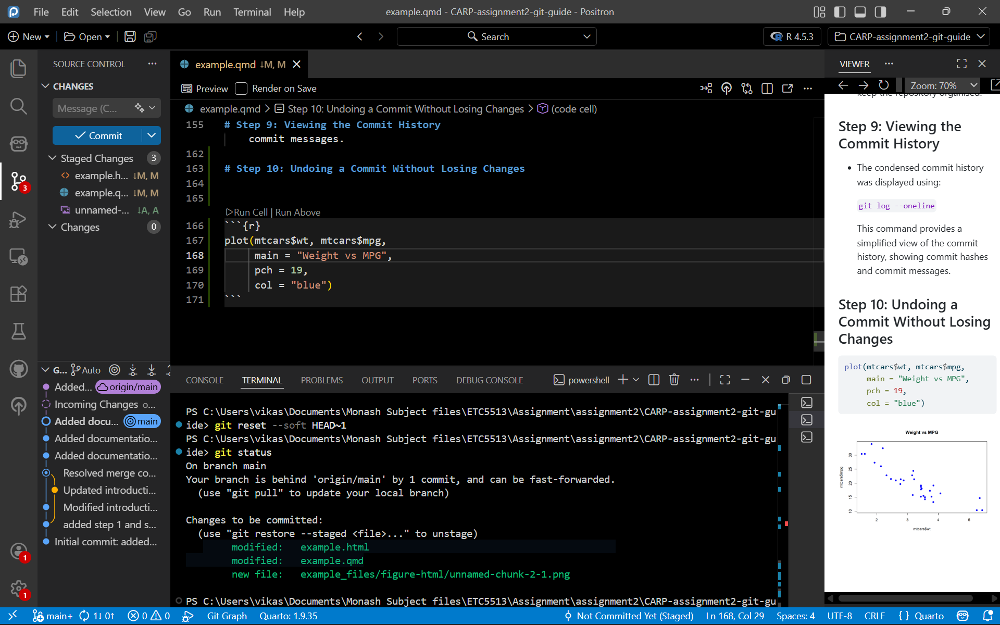

# Conclusion

This guide demonstrated the use of Git, GitHub, and command-line workflows within a reproducible Quarto project.  
The workflow included repository initialisation, branching, committing changes, resolving merge conflicts, tagging versions, viewing commit history, and undoing commits while preserving local changes.

These steps demonstrate how version control tools can support collaborative and reproducible development workflows.


# AI Acknowledgement

AI assistance was used in a limited manner during the development of this assessment, primarily for clarifying Git workflow behaviour, troubleshooting command-line issues, and improving the structure and readability of the written guide. The main tool used was ChatGPT.

The assignment workflow, Git operations, repository management, merge conflict handling, screenshots, Quarto document preparation, and final report construction were completed independently. AI-generated responses were not copied directly into the assessment without modification and were instead used to clarify concepts, troubleshoot errors, and improve documentation flow.

Screenshots of queries asked include:

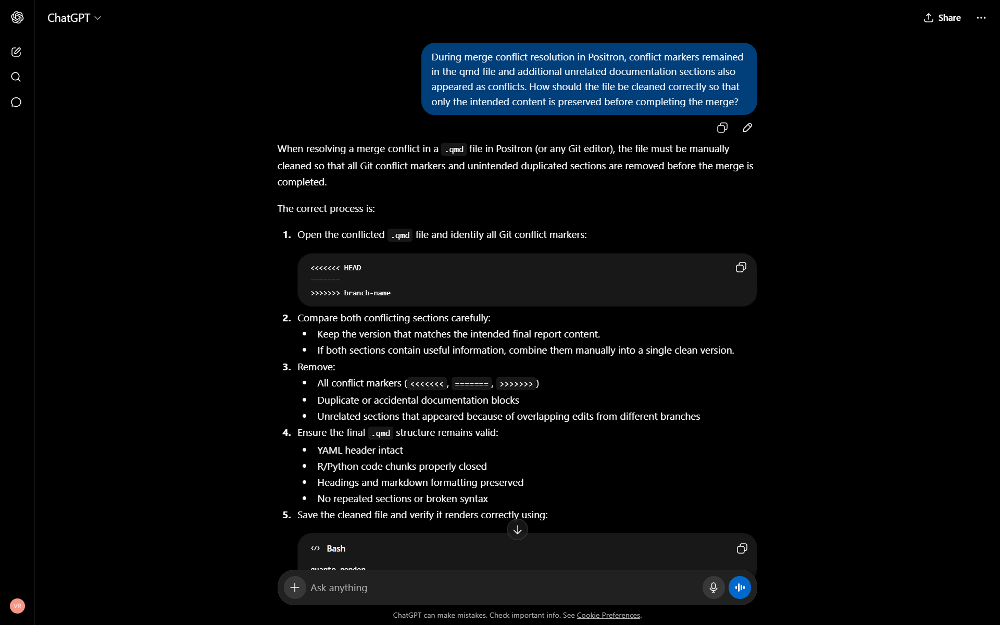
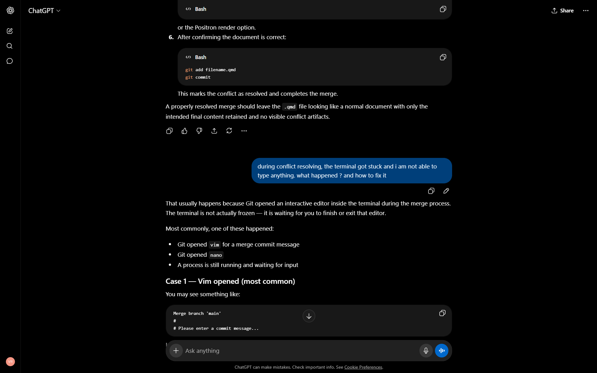
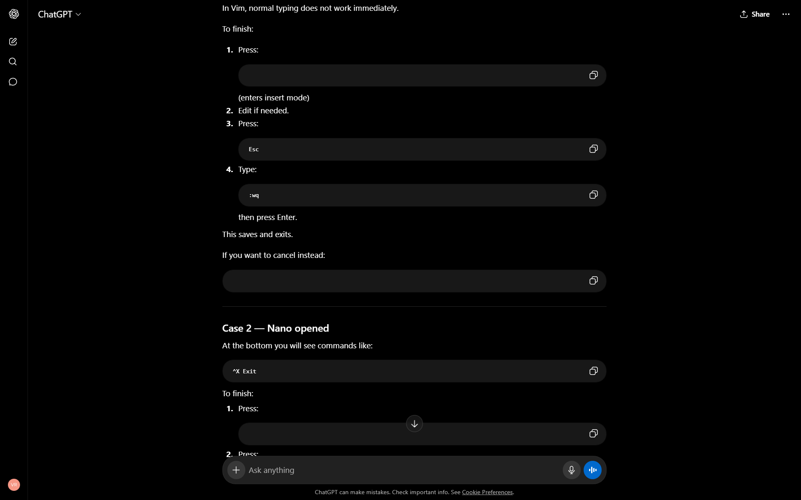
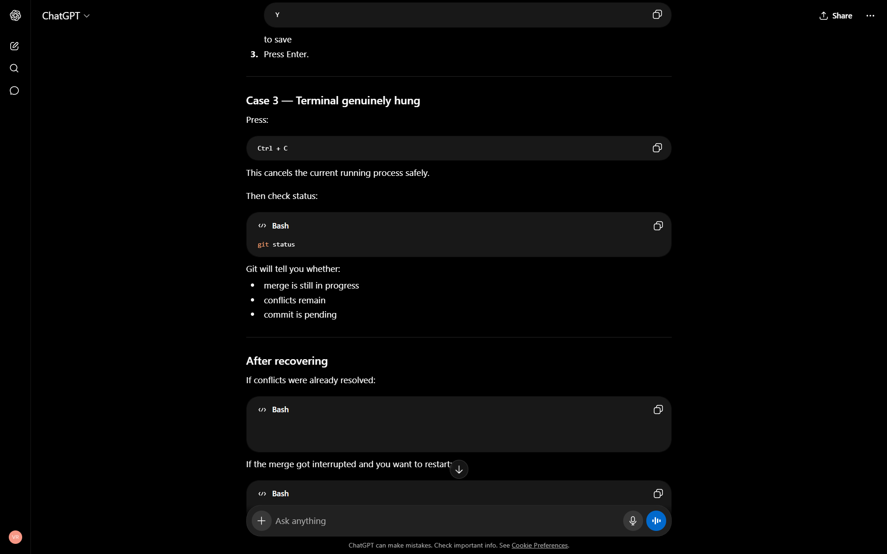
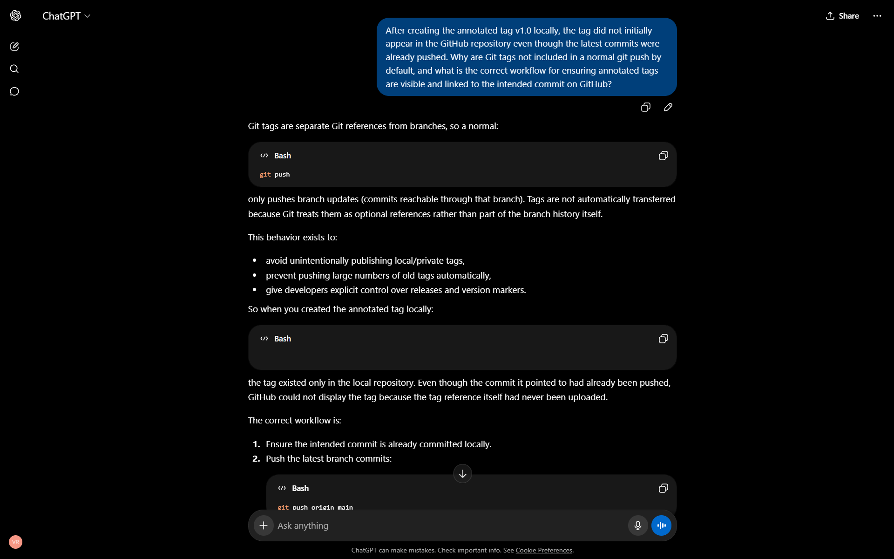
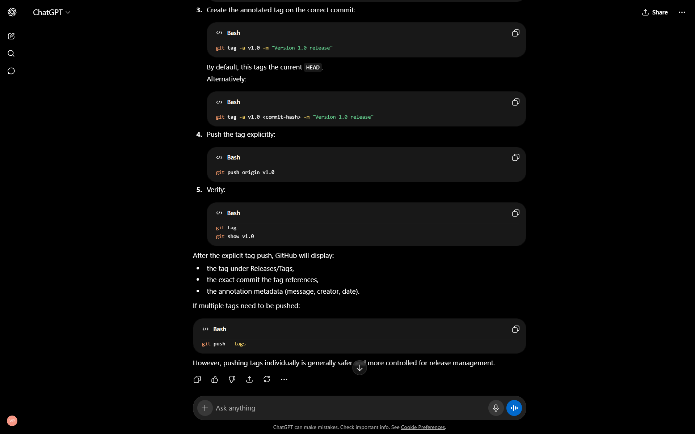
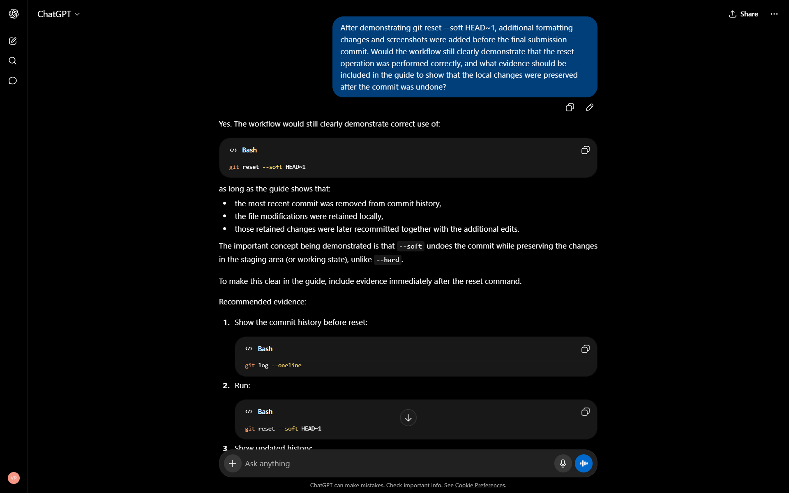
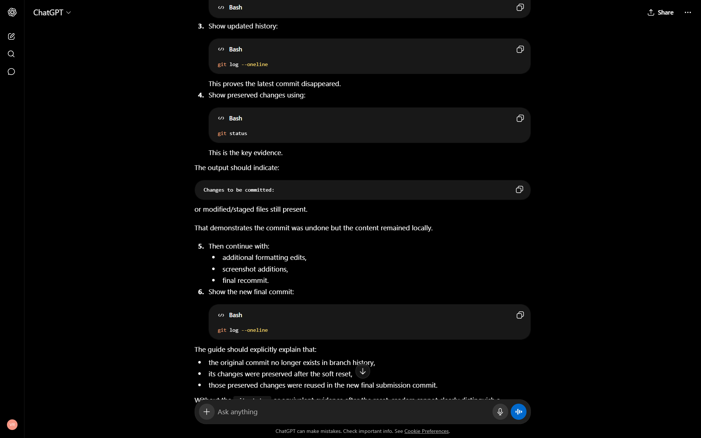
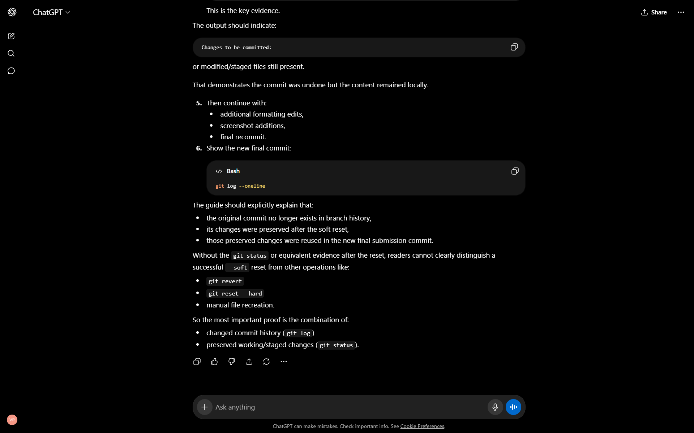
